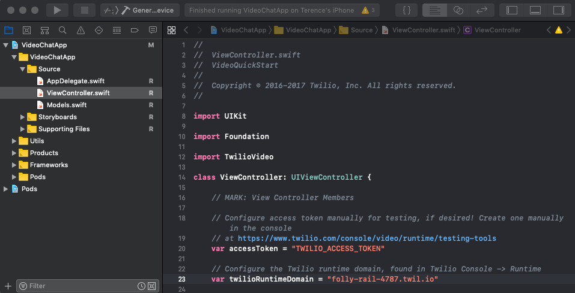
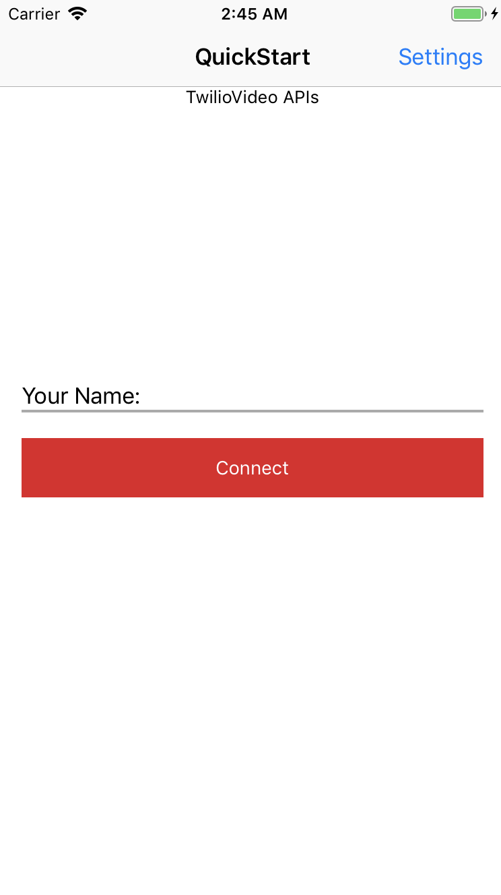

# Twilio Video Chat App for iOS

> NOTE: This sample application uses the Twilio Video 2.x APIs. For examples using our 3.0.0-beta APIs, please see the [3.0.0-beta](https://github.com/twilio/video-quickstart-ios/tree/3.0.0-beta) branch. For examples using our 1.x APIs, please see the [1.x](https://github.com/twilio/video-quickstart-ios/tree/1.x) branch.

> NOTE: This application was based on the [Twilio Video Quickstart for iOS](https://github.com/twilio/video-quickstart-ios) repository. While that repository includes multiple sample apps for iOS, this project focuses on the video chat. All other sample apps have been removed. If you'd like to see the other example iOS apps, please visit the [Twilio Video Quickstart for iOS](https://github.com/twilio/video-quickstart-ios) repository.

Get started with Video on iOS:

- [Flex Dependency](#flex-dependency) - Key dependencies for this app
- [Setup](#setup) - Get setup
- [Quickstart](#quickstart) - Run the Video Chat App
- [More Documentation](#more-documentation) - More documentation related to the iOS Video SDK
- [Issues & Support](#issues-and-support) - Filing issues and general support
- [License](#license)

## Flex Dependency

> **NOTE: Please ensure these dependencies are in place before testing the iOS Video Chat App to avoid errors**

This sample application is designed to start a video chat with a contact center agent using the [Twilio Flex](https://www.twilio.com/flex) platform. In order to fully test this application with Flex, there is a corresponding Flex plugin and associated Twilio Functions that must be deployed.

The repository for the Flex plugin and Twilio Functions can be found here:

https://github.com/trogers-twilio/plugin-video-chat

Please follow the instructions on that repository's README to deploy the Functions and Flex plugin.

## Setup

This repository contains example code written in both Objective-C and Swift. The Swift examples use Apple's Swift 4.2 programming language for iOS.

If you haven't used Twilio before, welcome! You'll need to [Sign up for a Twilio account](https://www.twilio.com/try-twilio) first. It's free!

### CocoaPods

1. Install [CocoaPods 1.0.0+](https://guides.cocoapods.org/using/getting-started.html).

1. Run `pod install` from the root directory of this project. CocoaPods will install `TwilioVideo.framework` and then set up an `xcworkspace`.

1. Open `VideoChatApp.xcworkspace`.

Note: You may need to update the CocoaPods [Master Spec Repo](https://github.com/CocoaPods/Specs) by running `pod repo update master` in order to fetch the latest specs for TwilioVideo.

### Manual Integration

You can integrate `TwilioVideo.framework` manually by following these [install instructions](https://www.twilio.com/docs/video/ios-v2-getting-started#manual).

## Quickstart

### Running the Video Chat App

To get started with the Video Chat application follow these steps:

1. With `VideoChatApp.xcworkspace` open in Xcode, navigate to `VideoChatApp -> VideoChatApp -> Source -> View` in the Project Navigator and open `ViewController.swift

2. Search for the following variable declaration:
    * `var twilioRuntimeDomain = "{string value}"`

3. Enter the runtime domain of your Twilio Flex project. This can be found on the [Twilio Runtime Dashboard](https://www.twilio.com/console/runtime/overview).

4. Run the Quickstart app on your iOS device or simulator.

5. Ensure you are running the Flex plugin this app is dependent on and you are logged into Flex. The Flex plugin can be found at this Github repo: https://github.com/trogers-twilio/plugin-video-chat

6. Once you are logged into Flex, enter a name into the `Your Name` field of the app and click/tap `Connect`.

7. You should see a new task show up in Flex. Accept the task and accept any prompts to allow use of the camera or microphone.

8. You should now see the video feed from the machine running Flex show up in the iOS app. If you are running the iOS app on a physical device, then that device's video feed should be visible in Flex.

### Using a Simulator

You can use the iOS Simulator that comes with Xcode to do your testing, but local video will not be shared since the Simulator cannot access a camera.

Note: If you have an iOS device, you can now run apps from Xcode on your device without a paid developer account.

## More Documentation

You can find more documentation on getting started as well as our latest Docs below:

* [Getting Started](https://www.twilio.com/docs/video/ios-v2-getting-started)
* [Docs](https://twilio.github.io/twilio-video-ios/docs/latest/index.html)

## Issues and Support

Please file any issues you find here on Github.
Please ensure that you are not sharing any
[Personally Identifiable Information(PII)](https://www.twilio.com/docs/glossary/what-is-personally-identifiable-information-pii)
or sensitive account information (API keys, credentials, etc.) when reporting an issue.

For general inquiries related to the Video SDK you can file a [support ticket](https://support.twilio.com/hc/en-us/requests/new).

## License

[MIT License](https://github.com/twilio/video-quickstart-ios/blob/master/LICENSE)
